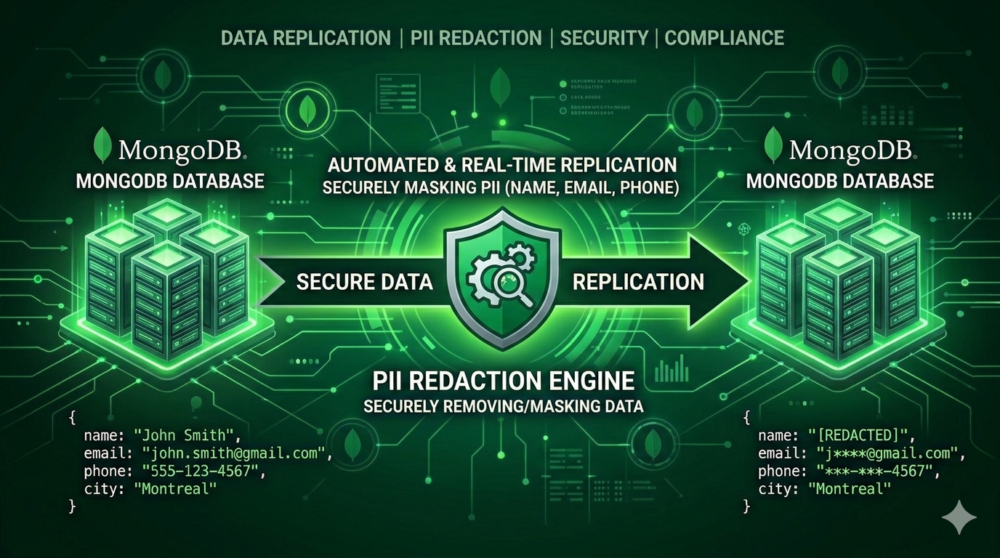

# MongoDB Replication Tool

<p align="center">
  
</p>

[](https://opensource.org/licenses/MIT)
[](https://www.python.org/downloads/)
[](https://github.com/nhuray/mongo-replication/stargazers)
[](https://github.com/nhuray/mongo-replication/issues)
[](https://github.com/astral-sh/ruff)

A production-grade MongoDB replication tool with built-in PII redaction, parallel processing, cascade filtering, and intelligent state management.

## ✨ Features

### Core Capabilities
- **Parallel Replication**: Process multiple collections simultaneously with configurable worker pools
- **Incremental Loading**: Cursor-based state management for efficient incremental updates
- **PII Redaction**: Built-in support for detecting and anonymizing sensitive data using Microsoft Presidio
- **Schema Relationship Inference**: Automatically detect parent-child relationships between collections
- **Cascade Filtering**: Replicate related documents across collections based on defined relationships
- **Native BSON Support**: Preserves MongoDB data types (ObjectId, Date, Decimal128, etc.)
- **Multiple Write Modes**: Support for replace, append, and merge strategies
- **Field Transformations**: Apply custom transformations to fields during replication
- **Index Management**: Automatically replicate indexes from source to destination

### State Management
- **Run Tracking**: Track job runs with comprehensive statistics and error reporting
- **Collection State**: Detailed per-collection state with cursor position tracking
- **Configurable State Collections**: Customize state collection names via configuration
- **Automatic Index Cleanup**: Handles migration from legacy state schemas

## 📦 Installation

```bash
pip install mongo-replication
```

For development installation:

```bash
git clone https://github.com/nhuray/mongo-replication.git
cd mongo-replication
uv sync
```

## 🚀 Quick Start

### 1. Initialize a New Job

The `init` command launches an interactive wizard that guides you through the setup process:

```bash
mongorep init my_job
```

The wizard will:
- Prompt for source and destination MongoDB URIs
- Validate connections to both databases
- Configure collection discovery patterns
- Set up PII detection settings
- Select anonymization strategies
- Choose which collections to replicate
- Generate configuration file at `config/my_job_config.yaml`
- Display environment variables to add to `.env`

**Note:** The `init` command can configure both source and destination connections interactively. You can skip the environment variables step if you provide URIs during initialization.

### 2. Configure Environment Variables (Alternative)

If you prefer to configure via environment variables instead of the interactive wizard, add to your `.env` file:

```env
MONGOREP_MY_JOB_SOURCE_URI=mongodb://source-host:27017/source_db
MONGOREP_MY_JOB_DESTINATION_URI=mongodb://dest-host:27017/dest_db
MONGOREP_MY_JOB_CONFIG_PATH=config/my_job_config.yaml
MONGOREP_MY_JOB_ENABLED=true
```

### 3. Scan Collections (Optional)

After initialization, optionally run scan to analyze collections and detect PII:

```bash
mongorep scan my_job
```

This will:
- Analyze document schemas
- Detect PII fields automatically using Presidio
- Infer schema relationships between collections (if enabled)
- Update configuration with findings
- Generate PII detection report

### 4. Run Replication

```bash
# Replicate all configured collections
mongorep run my_job

# Replicate specific collections
mongorep run my_job --collections users,orders

# Cascade replication from specific document IDs
mongorep run my_job --ids customers=507f1f77bcf86cd799439011

# Cascade replication from a MongoDB query
mongorep run my_job --query customers='{"plan": "Basic"}'

# Interactive mode - select collections to replicate
mongorep run my_job --interactive

# Dry run - preview without executing
mongorep run my_job --dry-run
```

## ⚙️ Configuration

### Basic Configuration Structure

```yaml
# MongoDB Replication Tool - Job Configuration
#
# This configuration was generated by 'mongorep init' command.
# You can edit this file to customize your replication settings.
#
# For full documentation, see: src/rep/config/defaults.yaml
#
# Configuration precedence:
#   1. System defaults (defaults.yaml)
#   2. This file (job-specific overrides)
#   3. CLI arguments (highest priority)

# =============================================================================
# SCAN CONFIGURATION
# =============================================================================
# Controls which collections are scanned for PII and how PII is detected.

scan:
  # Collection Discovery
  # ---------------------
  # Use regex patterns to filter which collections are scanned
  discovery:
    # Include patterns: Only scan collections matching these patterns
    # Empty list = scan all collections
    include_patterns: [ ]

    # Exclude patterns: Skip collections matching these patterns
    # Applied after include_patterns
    exclude_patterns: [ ]  # Don't exclude any collections

  # Sampling Configuration
  # ----------------------
  # Configure how many documents to sample for analysis
  sampling:
    # Number of documents to analyze per collection
    # Larger sample = more accurate but slower
    sample_size: 10

    # Sampling strategy: 'stratified' or 'random'
    # stratified = distributed across collection, random = random selection
    sample_strategy: stratified

  # PII Detection Settings
  # ----------------------
  # Configure automatic PII detection using Microsoft Presidio
  pii_analysis:
    enabled: True

    # Confidence threshold (0.0-1.0)
    # Higher = fewer false positives, Lower = more sensitive
    confidence_threshold: 0.85

    # PII entity types to detect
    # Common types: EMAIL_ADDRESS, PHONE_NUMBER, PERSON, CREDIT_CARD,
    #                US_SSN, IBAN_CODE, IP_ADDRESS, URL
    entity_types:
      - EMAIL_ADDRESS
      - PHONE_NUMBER
      - PERSON
      - CREDIT_CARD
      - IBAN_CODE
      - US_SSN
      - IP_ADDRESS
      - URL

    # Anonymization operators per entity type
    # See docs/presidio.md for all available operators:
    #   Built-in: replace, redact, mask, hash, encrypt, keep
    #   Custom: fake_email, fake_name, fake_phone, smart_redact, stripe_testing_cc, etc.
    # Default mappings (configured in src/mongo_replication/config/presidio.yaml):
    #   EMAIL_ADDRESS: smart_redact  (preserves domain)
    #   PERSON: replace              (replaces with "ANONYMOUS")
    #   PHONE_NUMBER: mask           (shows last 4 digits)
    #   US_SSN: mask                 (shows last 4 digits)
    #   CREDIT_CARD: hash            (SHA-256 hash)
    #   See docs/presidio.md for complete list

    # Allowlist: Fields to skip PII detection (false positives)
    # Format: collection.field (e.g., users.user_id)
    allowlist: [ ]  # No allowlist entries

# =============================================================================
# REPLICATION CONFIGURATION
# =============================================================================
# Controls how collections are replicated from source to destination.
# This section is typically generated after running 'mongorep scan'.

replication:
  # Collection Discovery
  # --------------------
  # Controls which collections are automatically discovered and replicated
  discovery:
    replicate_all: True
    include_patterns: [ ]
    exclude_patterns: [ ]

  # State Management
  # ----------------
  # Configuration for replication state tracking
  state_management:
    runs_collection: _rep_runs
    state_collection: _rep_state

  # Performance Settings
  # --------------------
  # Configuration for parallel processing and batch sizes
  performance:
    # Collections to replicate concurrently
    max_parallel_collections: 5
    # Documents per batch (higher = faster but more memory)
    batch_size: 1000

  # Collection Defaults
  # -------------------
  # Default settings that apply to all collections unless overridden
  defaults:
    # Write strategy: merge (upsert), append (insert), replace (drop/recreate)
    write_disposition: merge
    # Cursor field candidates (checked in order)
    cursor_fields: [ updated_at, updatedAt, meta.updated_at, meta.updatedAt ]
    # Fallback cursor field when no cursor_fields match
    cursor_fallback_field: _id
    # Initial cursor value for first-time replication
    cursor_initial_value: '2020-01-01T00:00:00Z'
    # Error handling: skip (log and continue) or fail (stop replication)
    transform_error_mode: skip

  # Collection-Specific Configuration
  # ----------------------------------
  # Override defaults and specify PII fields for each collection
  collections:
```

See [Configuration Documentation](docs/configuration.md) for complete reference.

## 🔧 CLI Commands

### `init` - Initialize a New Job

The `init` command provides an interactive wizard to set up a new replication job. It guides you through:
- Configuring source and destination MongoDB connections
- Setting up collection discovery (include/exclude patterns)
- Configuring PII detection settings
- Selecting anonymization strategies per entity type
- Choosing which collections to replicate

```bash
mongorep init <job_name> [OPTIONS]

Arguments:
  job_name              Job ID (e.g., 'prod_db', 'staging_db')

Options:
  --output  -o  PATH    Output config file path (default: config/<job>_config.yaml)
  --help                Show this message and exit.

Examples:
  # Initialize configuration for prod_db job
  mongorep init prod_db

  # Specify custom output path
  mongorep init prod_db --output /custom/path/config.yaml
```

The wizard will:
1. **Prompt for source MongoDB URI** and validate the connection
2. **Prompt for destination MongoDB URI** and validate the connection
3. **Configure collection discovery** with include/exclude patterns
4. **Set up PII detection** (confidence threshold, entity types, sample size)
5. **Configure anonymization strategies** for each PII entity type
6. **Select collections to replicate** (all, specific patterns, or manual selection)
7. **Generate configuration file** at the specified path
8. **Display environment variables** to add to your `.env` file

After running `init`, you can:
- Run `mongorep scan <job_name>` to analyze collections and detect PII
- Run `mongorep run <job_name>` to start replication
- Manually edit the generated config file to fine-tune settings

### `scan` - Auto-Discover Collections

```bash
mongorep scan <job_name> [OPTIONS]

Options:
 --output       -o      TEXT     Output path for config file (default: config/<job>_config.yaml)                                                                                                                 │
 --collections          TEXT     Comma-separated list of collections to scan (default: all)                                                                                                                      │
 --interactive  -i               Interactively select collections to scan                                                                                                                                        │
 --sample-size  -s      INTEGER  Number of documents to sample per collection (default: from config or 1000)                                                                                                     │
 --confidence   -c      FLOAT    Minimum confidence for PII detection (default: from config or 0.85)                                                                                                             │
 --language     -l      TEXT     Language for NLP analysis (default: en)                                                                                                                                         │
 --no-pii                        Skip PII analysis (only discover collections)                                                                                                                                   │
 --help                          Show this message and exit.
```

### `run` - Execute Replication

```bash
mongorep run <job_name> [OPTIONS]

Options:
  --collections          TEXT     Comma-separated list of collections to replicate (default: all configured)
  --interactive  -i               Interactively select collections to replicate
  --dry-run                       Preview what would be replicated without executing
  --parallel     -p      INTEGER  Maximum number of parallel collections (default: from config or 5)
  --batch-size   -b      INTEGER  Batch size for document processing
  --ids                  TEXT     Cascade replication from specific document IDs.
                                  Format: collection=id1,id2,id3
                                  Example: --ids customers=507f1f77bcf86cd799439011,507f191e810c19729de860ea
  --query                TEXT     Cascade replication from MongoDB query.
                                  Format: collection='{"field": "value"}'
                                  Example: --query customers='{"plan": "Basic"}'
  --help                          Show this message and exit.

Examples:
  # Replicate all configured collections
  mongorep run my_job

  # Replicate specific collections
  mongorep run my_job --collections users,orders

  # Cascade replication by IDs
  mongorep run my_job --ids customers=507f1f77bcf86cd799439011

  # Cascade replication by query
  mongorep run my_job --query customers='{"plan": "Basic", "status": "active"}'

  # Interactive mode
  mongorep run my_job --interactive

  # Dry run
  mongorep run my_job --dry-run
```

## 🎯 Advanced Usage

### Cascade Replication

Replicate related documents across collections using defined relationships. You can filter the root collection by IDs or by query.

**By Specific IDs:**
```bash
# Replicate specific customers and all related orders, invoices, etc.
mongorep run my_job --ids customers=507f1f77bcf86cd799439011

# Multiple IDs
mongorep run my_job --ids customers=507f1f77bcf86cd799439011,507f191e810c19729de860ea
```

**By MongoDB Query:**
```bash
# Replicate customers matching a query and all related data
mongorep run my_job --query customers='{"plan": "Basic"}'

# Complex queries
mongorep run my_job --query customers='{"status": "active", "createdAt": {"$gte": "2024-01-01"}}'
```

**Define Relationships in Configuration:**

```yaml
schema_relationships:
  - parent: customers
    child: orders
    parent_field: _id
    child_field: customer_id

  - parent: orders
    child: order_items
    parent_field: _id
    child_field: order_id
```

The tool will:
1. Find documents in the root collection matching your filter (IDs or query)
2. Find related documents in child collections based on relationships
3. Cascade through the entire relationship chain
4. Replicate all matching documents

### PII Redaction

Built-in PII detection and anonymization:

```yaml
replication:
   collections:
     users:
       pii:
         enabled: true
         fields:
           - email
           - phone
           - ssn
         detection_mode: field_name  # or 'content'
         anonymization:
           email: mask          # user@example.com → u***@example.com
           phone: hash          # Hash the value
           ssn: redact          # Replace with [REDACTED]
           address: replace     # Replace with fake data
```

### Field Transformations

Apply custom transformations:

```yaml
replication:
   collections:
     orders:
       field_transforms:
         - field: billing_plan
           type: regex_replace
           pattern: '.*'
           replacement: 'free'
```

### Field Exclusion

Exclude sensitive fields:

```yaml
replication:
   collections:
     users:
       fields_exclude:
         - password_hash
         - internal_notes
          - legacy_data
```

## 💾 State Management

The tool maintains two state collections:

### `_rep_runs` - Job Run Tracking
Tracks each replication job run with:
- Status (running, completed, failed)
- Timestamps and duration
- Document/collection statistics
- Error summaries

### `_rep_state` - Collection State
Per-collection state including:
- Last cursor position for incremental loading
- Processing status
- Error details
- Link to parent run


## 🐍 Programmatic Usage

Use as a Python library:

```python
from mongo_replication import (
    ConnectionManager,
    ReplicationOrchestrator,
    load_replication_config
)

# Load configuration
config = load_replication_config("config/my_job_config.yaml")

# Setup connections
conn_mgr = ConnectionManager(
    source_uri="mongodb://source:27017/source_db",
    dest_uri="mongodb://dest:27017/dest_db"
)

# Create orchestrator
orchestrator = ReplicationOrchestrator(
    connection_manager=conn_mgr,
    config=config
)

# Execute replication
result = orchestrator.replicate()

print(f"Collections processed: {result.total_collections_processed}")
print(f"Documents replicated: {result.total_documents_processed}")
print(f"Duration: {result.total_duration_seconds}s")
```

## 🏗️ Architecture

See [Technical Design Documentation](docs/technical-design.md) for:
- System architecture overview
- State management design
- Parallel processing model
- PII detection pipeline
- Extension points

## ⚡ Performance Tips

1. **Batch Size**: Adjust based on document size and network latency
   - Large documents: 100-500
   - Small documents: 1000-5000

2. **Parallel Collections**: Balance based on available resources
   - Local replication: 5-10
   - Network replication: 3-5

3. **Indexes**: Ensure cursor fields are indexed on source collections

4. **Incremental Loading**: Use timestamp-based cursor fields for optimal performance

## 🔍 Troubleshooting

**Performance issues**
```bash
# Reduce parallel processing
mongorep run my_job --max-parallel 2 --batch-size 500
```

**Connection timeouts**
- Increase `serverSelectionTimeoutMS` in connection URI
- Check network connectivity and firewall rules

### Debug Logging

Enable verbose logging:

```python
import logging
logging.basicConfig(level=logging.DEBUG)
```

## 🤝 Contributing

Contributions are welcome! Please:

1. Fork the repository
2. Create a feature branch
3. Add tests for new functionality
4. Ensure all tests pass
5. Submit a pull request

## 📄 License

MIT License - see [LICENSE](LICENSE) file for details.

## 💬 Support

- **Issues**: [GitHub Issues](https://github.com/nhuray/mongo-replication/issues)
- **Documentation**: [Full Documentation](https://github.com/nhuray/mongo-replication#readme)

## 🙏 Acknowledgments

Built with:
- [PyMongo](https://pymongo.readthedocs.io/) - MongoDB Python driver
- [Typer](https://typer.tiangolo.com/) - CLI framework
- [Rich](https://rich.readthedocs.io/) - Terminal formatting
- [Presidio](https://microsoft.github.io/presidio/) - PII detection and anonymization
