# Scan Report: staging-ca

**Generated:** 2026-04-13 14:05:36

---

## Summary

- **Total Collections:** 39
- **Documents Sampled:** 3,417
- **Collections with PII:** 25
- **Total PII Fields:** 263
- **Collections with Cursor Fields:** 34
- **Schema Relationships Found:** 47

---

## PII Analysis

### activities

**Samples Analyzed:** 100

| Field | Entity Type | Strategy | Prevalence | Avg Confidence | Detections |
|-------|-------------|----------|------------|----------------|------------|
| `params.full_name` | PERSON | `smart_redact` | 21.0% | 0.85 | 21/100 |

### addons

**Samples Analyzed:** 93

| Field | Entity Type | Strategy | Prevalence | Avg Confidence | Detections |
|-------|-------------|----------|------------|----------------|------------|
| `uuid` | PERSON | `smart_redact` | 22.6% | 0.85 | 21/93 |

### beneficiaries

**Samples Analyzed:** 100

| Field | Entity Type | Strategy | Prevalence | Avg Confidence | Detections |
|-------|-------------|----------|------------|----------------|------------|
| `name` | PERSON | `smart_redact` | 66.0% | 0.85 | 66/100 |
| `firstName` | PERSON | `smart_redact` | 48.0% | 0.85 | 48/100 |
| `email` | EMAIL_ADDRESS | `smart_redact` | 43.0% | 1.00 | 43/100 |
| `lastName` | PERSON | `smart_redact` | 40.0% | 0.85 | 40/100 |
| `middleName` | PERSON | `smart_redact` | 21.0% | 0.85 | 21/100 |
| `willname` | PERSON | `smart_redact` | 14.0% | 0.85 | 14/100 |
| `fields.familyMemberType` | PERSON | `smart_redact` | 10.0% | 0.85 | 10/100 |

### billingplans

**Samples Analyzed:** 100

| Field | Entity Type | Strategy | Prevalence | Avg Confidence | Detections |
|-------|-------------|----------|------------|----------------|------------|
| `billingEmail` | EMAIL_ADDRESS | `smart_redact` | 78.0% | 1.00 | 78/100 |

### distributionrequests

**Samples Analyzed:** 100

| Field | Entity Type | Strategy | Prevalence | Avg Confidence | Detections |
|-------|-------------|----------|------------|----------------|------------|
| `requestNote` | PERSON | `smart_redact` | 34.0% | 0.85 | 34/100 |

### documents

**Samples Analyzed:** 100

| Field | Entity Type | Strategy | Prevalence | Avg Confidence | Detections |
|-------|-------------|----------|------------|----------------|------------|
| `name` | PERSON | `smart_redact` | 24.0% | 0.85 | 24/100 |
| `file.originalname` | PERSON | `smart_redact` | 18.0% | 0.85 | 18/100 |

### estates

**Samples Analyzed:** 100

| Field | Entity Type | Strategy | Prevalence | Avg Confidence | Detections |
|-------|-------------|----------|------------|----------------|------------|
| `name` | PERSON | `smart_redact` | 79.0% | 0.85 | 79/100 |
| `executors.name` | PERSON | `smart_redact` | 64.0% | 0.85 | 64/100 |
| `executors.firstName` | PERSON | `smart_redact` | 56.0% | 0.85 | 56/100 |
| `executors.email` | EMAIL_ADDRESS | `smart_redact` | 49.0% | 1.00 | 49/100 |
| `executors.middleName` | PERSON | `smart_redact` | 36.0% | 0.85 | 36/100 |
| `executors.lastName` | PERSON | `smart_redact` | 33.0% | 0.85 | 33/100 |
| `executors.fields.familyMemberType` | PERSON | `smart_redact` | 17.0% | 0.85 | 17/100 |
| `contacts.name` | PERSON | `smart_redact` | 11.0% | 0.85 | 11/100 |

### globalsearch

**Samples Analyzed:** 100

| Field | Entity Type | Strategy | Prevalence | Avg Confidence | Detections |
|-------|-------------|----------|------------|----------------|------------|
| `fields.caseName` | PERSON | `smart_redact` | 95.0% | 0.85 | 95/100 |
| `value` | PERSON | `smart_redact` | 49.0% | 0.85 | 49/100 |
| `fields.beneficiaryName` | PERSON | `smart_redact` | 42.0% | 0.85 | 42/100 |
| `fields.contactName` | PERSON | `smart_redact` | 16.0% | 0.85 | 16/100 |

### integrations

**Samples Analyzed:** 20

| Field | Entity Type | Strategy | Prevalence | Avg Confidence | Detections |
|-------|-------------|----------|------------|----------------|------------|
| `info.accounts.transactions.description` | PERSON | `smart_redact` | 990.0% | 0.85 | 198/20 |
| `info.accounts.holder.name` | PERSON | `smart_redact` | 355.0% | 0.85 | 71/20 |
| `info.accounts.holder.email` | EMAIL_ADDRESS | `smart_redact` | 355.0% | 1.00 | 71/20 |
| `info.accounts.transactions.id` | PERSON | `smart_redact` | 220.0% | 0.85 | 44/20 |
| `info.accounts.holder.address.postalCode` | PERSON | `smart_redact` | 90.0% | 0.85 | 18/20 |
| `info.login.username` | PERSON | `smart_redact` | 30.0% | 0.85 | 6/20 |

### inventories

**Samples Analyzed:** 100

| Field | Entity Type | Strategy | Prevalence | Avg Confidence | Detections |
|-------|-------------|----------|------------|----------------|------------|
| `marketValues.linkedTransactionCategory` | PERSON | `smart_redact` | 16.0% | 0.85 | 16/100 |

### jobs

**Samples Analyzed:** 100

| Field | Entity Type | Strategy | Prevalence | Avg Confidence | Detections |
|-------|-------------|----------|------------|----------------|------------|
| `result.transactions.category` | PERSON | `smart_redact` | 406.0% | 0.85 | 406/100 |
| `draft.stepData.validateFileData.result.transactions.category` | PERSON | `smart_redact` | 201.0% | 0.85 | 201/100 |
| `result.transactions.description` | PERSON | `smart_redact` | 69.0% | 0.85 | 69/100 |
| `payload.userName` | PERSON | `smart_redact` | 50.0% | 0.85 | 50/100 |
| `draft.stepData.validateFileData.result.transactions.description` | PERSON | `smart_redact` | 38.0% | 0.85 | 38/100 |
| `draft.stepData.validateStatementOutputData.transactions.description` | PERSON | `smart_redact` | 38.0% | 0.85 | 38/100 |
| `result.holdings.description` | PERSON | `smart_redact` | 15.0% | 0.85 | 15/100 |

### notifications

**Samples Analyzed:** 100

| Field | Entity Type | Strategy | Prevalence | Avg Confidence | Detections |
|-------|-------------|----------|------------|----------------|------------|
| `params.estateName` | PERSON | `smart_redact` | 49.0% | 0.85 | 49/100 |
| `params.userName` | PERSON | `smart_redact` | 22.0% | 0.85 | 22/100 |
| `params.caseName` | PERSON | `smart_redact` | 15.0% | 0.85 | 15/100 |
| `pathName` | PERSON | `smart_redact` | 12.0% | 0.85 | 12/100 |

### orgs

**Samples Analyzed:** 100

| Field | Entity Type | Strategy | Prevalence | Avg Confidence | Detections |
|-------|-------------|----------|------------|----------------|------------|
| `invitations.invitee.email` | EMAIL_ADDRESS | `smart_redact` | 554.0% | 1.00 | 554/100 |
| `invitations.invitee.name` | PERSON | `smart_redact` | 502.0% | 0.85 | 502/100 |
| `info.lawyers.email` | EMAIL_ADDRESS | `smart_redact` | 136.0% | 1.00 | 136/100 |
| `info.lawyers.name` | PERSON | `smart_redact` | 133.0% | 0.85 | 133/100 |
| `name` | PERSON | `smart_redact` | 42.0% | 0.85 | 42/100 |
| `invitations.token` | PERSON | `smart_redact` | 31.0% | 0.85 | 31/100 |
| `address.street` | PERSON | `smart_redact` | 12.0% | 0.85 | 12/100 |
| `theme.displayName` | PERSON | `smart_redact` | 11.0% | 0.85 | 11/100 |
| `address.city` | PERSON | `smart_redact` | 11.0% | 0.85 | 11/100 |

### orgsresources

**Samples Analyzed:** 98

| Field | Entity Type | Strategy | Prevalence | Avg Confidence | Detections |
|-------|-------------|----------|------------|----------------|------------|
| `contacts.name` | PERSON | `smart_redact` | 213.3% | 0.85 | 209/98 |
| `contacts.email` | EMAIL_ADDRESS | `smart_redact` | 127.6% | 1.00 | 125/98 |
| `contacts.address.street` | PERSON | `smart_redact` | 13.3% | 0.85 | 13/98 |

### packages

**Samples Analyzed:** 24

| Field | Entity Type | Strategy | Prevalence | Avg Confidence | Detections |
|-------|-------------|----------|------------|----------------|------------|
| `log.letters.json` | PERSON | `smart_redact` | 50.0% | 0.85 | 12/24 |

### resources

**Samples Analyzed:** 100

| Field | Entity Type | Strategy | Prevalence | Avg Confidence | Detections |
|-------|-------------|----------|------------|----------------|------------|
| `content.groups.fields.options.label` | PERSON | `smart_redact` | 38.0% | 0.85 | 38/100 |
| `content.groups.fields.options.id` | PERSON | `smart_redact` | 32.0% | 0.85 | 32/100 |
| `content.variables.executorName.value` | PERSON | `smart_redact` | 21.0% | 0.85 | 21/100 |
| `content.variables.delivery.options.label` | PERSON | `smart_redact` | 18.0% | 0.85 | 18/100 |
| `content.variables.signer.options.label` | PERSON | `smart_redact` | 18.0% | 0.85 | 18/100 |
| `content.variables.signer.options.value` | PERSON | `smart_redact` | 18.0% | 0.85 | 18/100 |
| `content.form.fields.deceasedCity.options.value` | PERSON | `smart_redact` | 16.0% | 0.85 | 16/100 |
| `content.form.fields.deceasedCity.options.label` | PERSON | `smart_redact` | 16.0% | 0.85 | 16/100 |
| `content.template` | PERSON | `smart_redact` | 15.0% | 0.85 | 15/100 |
| `content.variables.lawyerNameLetterhead.value` | PERSON | `smart_redact` | 13.0% | 0.85 | 13/100 |
| `content.variables.userEmailLetterhead.ui-component.label` | PERSON | `smart_redact` | 13.0% | 0.85 | 13/100 |
| `content.variables.userInitials.value` | PERSON | `smart_redact` | 13.0% | 0.85 | 13/100 |
| `content.variables.lawyerInitials.value` | PERSON | `smart_redact` | 13.0% | 0.85 | 13/100 |
| `content.groups.fields.label` | PERSON | `smart_redact` | 12.0% | 0.85 | 12/100 |
| `content.variables.assignedLawyer.options.value` | PERSON | `smart_redact` | 11.0% | 0.85 | 11/100 |
| `content.variables.assignedLawyer.options.label` | PERSON | `smart_redact` | 11.0% | 0.85 | 11/100 |
| `content.variables.signer.value` | PERSON | `smart_redact` | 10.0% | 0.85 | 10/100 |
| `content.groups.phases.tasks.body` | PERSON | `smart_redact` | 10.0% | 0.85 | 10/100 |

### roles

**Samples Analyzed:** 100

| Field | Entity Type | Strategy | Prevalence | Avg Confidence | Detections |
|-------|-------------|----------|------------|----------------|------------|
| `permissions` | PERSON | `smart_redact` | 296.0% | 0.85 | 296/100 |

### substitutedecisionmakers

**Samples Analyzed:** 100

| Field | Entity Type | Strategy | Prevalence | Avg Confidence | Detections |
|-------|-------------|----------|------------|----------------|------------|
| `email` | EMAIL_ADDRESS | `smart_redact` | 70.0% | 1.00 | 70/100 |
| `firstName` | PERSON | `smart_redact` | 44.0% | 0.85 | 44/100 |
| `lastName` | PERSON | `smart_redact` | 27.0% | 0.85 | 27/100 |
| `middleName` | PERSON | `smart_redact` | 14.0% | 0.85 | 14/100 |

### tasktemplates

**Samples Analyzed:** 100

| Field | Entity Type | Strategy | Prevalence | Avg Confidence | Detections |
|-------|-------------|----------|------------|----------------|------------|
| `tasks.description` | PERSON | `smart_redact` | 20.0% | 0.85 | 20/100 |
| `tasks.name` | PERSON | `smart_redact` | 13.0% | 0.85 | 13/100 |

### transactions

**Samples Analyzed:** 100

| Field | Entity Type | Strategy | Prevalence | Avg Confidence | Detections |
|-------|-------------|----------|------------|----------------|------------|
| `category` | PERSON | `smart_redact` | 39.0% | 0.85 | 39/100 |
| `description` | PERSON | `smart_redact` | 24.0% | 0.85 | 24/100 |

### users

**Samples Analyzed:** 100

| Field | Entity Type | Strategy | Prevalence | Avg Confidence | Detections |
|-------|-------------|----------|------------|----------------|------------|
| `email` | EMAIL_ADDRESS | `smart_redact` | 99.0% | 1.00 | 99/100 |
| `firstName` | PERSON | `smart_redact` | 65.0% | 0.85 | 65/100 |
| `lastName` | PERSON | `smart_redact` | 49.0% | 0.85 | 49/100 |

### vaults_cases

**Samples Analyzed:** 100

| Field | Entity Type | Strategy | Prevalence | Avg Confidence | Detections |
|-------|-------------|----------|------------|----------------|------------|
| `name` | PERSON | `smart_redact` | 69.0% | 0.85 | 69/100 |
| `client.firstName` | PERSON | `smart_redact` | 69.0% | 0.85 | 69/100 |
| `client.lastName` | PERSON | `smart_redact` | 50.0% | 0.85 | 50/100 |
| `client.email` | EMAIL_ADDRESS | `smart_redact` | 39.0% | 1.00 | 39/100 |
| `willEnvelopeNumberAndPrefix` | PERSON | `smart_redact` | 35.0% | 0.85 | 35/100 |

### vaults_contacts

**Samples Analyzed:** 100

| Field | Entity Type | Strategy | Prevalence | Avg Confidence | Detections |
|-------|-------------|----------|------------|----------------|------------|
| `firstName` | PERSON | `smart_redact` | 80.0% | 0.85 | 80/100 |
| `lastName` | PERSON | `smart_redact` | 69.0% | 0.85 | 69/100 |
| `familyMemberType` | PERSON | `smart_redact` | 52.0% | 0.85 | 52/100 |
| `email` | EMAIL_ADDRESS | `smart_redact` | 51.0% | 1.00 | 51/100 |
| `middleName` | PERSON | `smart_redact` | 22.0% | 0.85 | 22/100 |

### workflow_executions

**Samples Analyzed:** 100

| Field | Entity Type | Strategy | Prevalence | Avg Confidence | Detections |
|-------|-------------|----------|------------|----------------|------------|
| `state._1.context.lastName` | PERSON | `smart_redact` | 55.0% | 0.85 | 55/100 |
| `state._1.context.firstName` | PERSON | `smart_redact` | 54.0% | 0.85 | 54/100 |
| `state._1_wizard_cqnbar_edit.id` | PERSON | `smart_redact` | 50.0% | 0.85 | 50/100 |
| `state._1_1_2.context.firstName` | PERSON | `smart_redact` | 42.0% | 0.85 | 42/100 |
| `state._1_wizard.context.lastName` | PERSON | `smart_redact` | 40.0% | 0.85 | 40/100 |
| `state._1_1_2_198405_996603_691429.context.collaboratorsAndInvited.user.email` | EMAIL_ADDRESS | `smart_redact` | 38.0% | 1.00 | 38/100 |
| `state._1_1_2_198405_996603_691429.context.collaboratorsAndInvited.user.name` | PERSON | `smart_redact` | 38.0% | 0.85 | 38/100 |
| `state._1_1_2_198405_996603_691429.context.collaboratorsAndInvited.invitee.email` | EMAIL_ADDRESS | `smart_redact` | 38.0% | 1.00 | 38/100 |
| `state._1_1_2_198405_996603_691429.context.collaboratorsAndInvited.invitee.name` | PERSON | `smart_redact` | 38.0% | 0.85 | 38/100 |
| `state._1_1_2_198405_996603_691429.context.signers.user.email` | EMAIL_ADDRESS | `smart_redact` | 38.0% | 1.00 | 38/100 |
| `state._1_1_2_198405_996603_691429.context.signers.user.name` | PERSON | `smart_redact` | 38.0% | 0.85 | 38/100 |
| `state._1_1_2_198405_996603_691429.context.signers.invitee.email` | EMAIL_ADDRESS | `smart_redact` | 38.0% | 1.00 | 38/100 |
| `state._1_1_2_198405_996603_691429.context.signers.invitee.name` | PERSON | `smart_redact` | 38.0% | 0.85 | 38/100 |
| `state._1_1_2_intake.context.firstName` | PERSON | `smart_redact` | 33.0% | 0.85 | 33/100 |
| `state._1_1_2_198405_996603_691429.context.collaboratorsAndInvited.user.firstName` | PERSON | `smart_redact` | 32.0% | 0.85 | 32/100 |
| `state._1_1_2_198405_996603_691429.context.collaboratorsAndInvited.user.lastName` | PERSON | `smart_redact` | 32.0% | 0.85 | 32/100 |
| `state._1_1_2_198405_996603_691429.context.collaboratorsAndInvited.invitee.firstName` | PERSON | `smart_redact` | 32.0% | 0.85 | 32/100 |
| `state._1_1_2_198405_996603_691429.context.collaboratorsAndInvited.invitee.lastName` | PERSON | `smart_redact` | 32.0% | 0.85 | 32/100 |
| `state._1_1_2_198405_996603_691429.context.signers.user.firstName` | PERSON | `smart_redact` | 32.0% | 0.85 | 32/100 |
| `state._1_1_2_198405_996603_691429.context.signers.user.lastName` | PERSON | `smart_redact` | 32.0% | 0.85 | 32/100 |
| `state._1_1_2_198405_996603_691429.context.signers.invitee.firstName` | PERSON | `smart_redact` | 32.0% | 0.85 | 32/100 |
| `state._1_1_2_198405_996603_691429.context.signers.invitee.lastName` | PERSON | `smart_redact` | 32.0% | 0.85 | 32/100 |
| `state._1_1_2.context.lastName` | PERSON | `smart_redact` | 29.0% | 0.85 | 29/100 |
| `state._1.context.caseDetailsFormValues.assignedLawyer` | PERSON | `smart_redact` | 28.0% | 0.85 | 28/100 |
| `state._1_1_2.context.caseDetailsFormValues.assignedLawyer` | PERSON | `smart_redact` | 28.0% | 0.85 | 28/100 |
| `state._1_1_2_intake.context.caseDetailsFormValues.assignedLawyer` | PERSON | `smart_redact` | 28.0% | 0.85 | 28/100 |
| `state._1.context.firstMiddleName` | PERSON | `smart_redact` | 22.0% | 0.85 | 22/100 |
| `state._1_1_2.context.firstMiddleName` | PERSON | `smart_redact` | 22.0% | 0.85 | 22/100 |
| `state._1_1_2_intake.context.firstMiddleName` | PERSON | `smart_redact` | 22.0% | 0.85 | 22/100 |
| `state._1_wizard.context.firstName` | PERSON | `smart_redact` | 21.0% | 0.85 | 21/100 |
| `state._1_1_2_intake.context.lastName` | PERSON | `smart_redact` | 20.0% | 0.85 | 20/100 |
| `state._1_1_2_198405_733808_465788.context.applicant.email` | EMAIL_ADDRESS | `smart_redact` | 20.0% | 1.00 | 20/100 |
| `state._1_1_2_198405_733808_465788.context.applicant.firstName` | PERSON | `smart_redact` | 20.0% | 0.85 | 20/100 |
| `state._1_1_2_198405_733808_465788.context.applicant.lastName` | PERSON | `smart_redact` | 20.0% | 0.85 | 20/100 |
| `state._1_1_2_198405_733808_465788.context.applicant.name` | PERSON | `smart_redact` | 20.0% | 0.85 | 20/100 |
| `state._1_1_2_198405_733808_465788.context.collaboratorsAndInvited.user.email` | EMAIL_ADDRESS | `smart_redact` | 20.0% | 1.00 | 20/100 |
| `state._1_1_2_198405_733808_465788.context.collaboratorsAndInvited.user.name` | PERSON | `smart_redact` | 20.0% | 0.85 | 20/100 |
| `state._1_1_2_198405_733808_465788.context.collaboratorsAndInvited.invitee.email` | EMAIL_ADDRESS | `smart_redact` | 20.0% | 1.00 | 20/100 |
| `state._1_1_2_198405_733808_465788.context.collaboratorsAndInvited.invitee.name` | PERSON | `smart_redact` | 20.0% | 0.85 | 20/100 |
| `state._1_1_2_198405_733808_465788.context.signers.user.email` | EMAIL_ADDRESS | `smart_redact` | 20.0% | 1.00 | 20/100 |
| `state._1_1_2_198405_733808_465788.context.signers.user.name` | PERSON | `smart_redact` | 20.0% | 0.85 | 20/100 |
| `state._1_1_2_198405_733808_465788.context.signers.invitee.email` | EMAIL_ADDRESS | `smart_redact` | 20.0% | 1.00 | 20/100 |
| `state._1_1_2_198405_733808_465788.context.signers.invitee.name` | PERSON | `smart_redact` | 20.0% | 0.85 | 20/100 |
| `state._1_1_2_198405_733808_405036.context.collaboratorsAndInvited.user.email` | EMAIL_ADDRESS | `smart_redact` | 20.0% | 1.00 | 20/100 |
| `state._1_1_2_198405_733808_405036.context.collaboratorsAndInvited.user.name` | PERSON | `smart_redact` | 20.0% | 0.85 | 20/100 |
| `state._1_1_2_198405_733808_405036.context.collaboratorsAndInvited.invitee.email` | EMAIL_ADDRESS | `smart_redact` | 20.0% | 1.00 | 20/100 |
| `state._1_1_2_198405_733808_405036.context.collaboratorsAndInvited.invitee.name` | PERSON | `smart_redact` | 20.0% | 0.85 | 20/100 |
| `state._1_1_2_198405_733808_405036.context.signers.user.email` | EMAIL_ADDRESS | `smart_redact` | 20.0% | 1.00 | 20/100 |
| `state._1_1_2_198405_733808_405036.context.signers.user.name` | PERSON | `smart_redact` | 20.0% | 0.85 | 20/100 |
| `state._1_1_2_198405_733808_405036.context.signers.invitee.email` | EMAIL_ADDRESS | `smart_redact` | 20.0% | 1.00 | 20/100 |
| `state._1_1_2_198405_733808_405036.context.signers.invitee.name` | PERSON | `smart_redact` | 20.0% | 0.85 | 20/100 |
| `state._1_1_2_198405_812882_750509.context.applicant.email` | EMAIL_ADDRESS | `smart_redact` | 20.0% | 1.00 | 20/100 |
| `state._1_1_2_198405_812882_750509.context.applicant.firstName` | PERSON | `smart_redact` | 20.0% | 0.85 | 20/100 |
| `state._1_1_2_198405_812882_750509.context.applicant.lastName` | PERSON | `smart_redact` | 20.0% | 0.85 | 20/100 |
| `state._1_1_2_198405_812882_750509.context.applicant.name` | PERSON | `smart_redact` | 20.0% | 0.85 | 20/100 |
| `state._1_1_2_198405_812882_750509.context.collaboratorsAndInvited.user.email` | EMAIL_ADDRESS | `smart_redact` | 20.0% | 1.00 | 20/100 |
| `state._1_1_2_198405_812882_750509.context.collaboratorsAndInvited.user.name` | PERSON | `smart_redact` | 20.0% | 0.85 | 20/100 |
| `state._1_1_2_198405_812882_750509.context.collaboratorsAndInvited.invitee.email` | EMAIL_ADDRESS | `smart_redact` | 20.0% | 1.00 | 20/100 |
| `state._1_1_2_198405_812882_750509.context.collaboratorsAndInvited.invitee.name` | PERSON | `smart_redact` | 20.0% | 0.85 | 20/100 |
| `state._1_1_2_198405_812882_750509.context.signers.user.email` | EMAIL_ADDRESS | `smart_redact` | 20.0% | 1.00 | 20/100 |
| `state._1_1_2_198405_812882_750509.context.signers.user.name` | PERSON | `smart_redact` | 20.0% | 0.85 | 20/100 |
| `state._1_1_2_198405_812882_750509.context.signers.invitee.email` | EMAIL_ADDRESS | `smart_redact` | 20.0% | 1.00 | 20/100 |
| `state._1_1_2_198405_812882_750509.context.signers.invitee.name` | PERSON | `smart_redact` | 20.0% | 0.85 | 20/100 |
| `state._1_1_2_198405_812882_228258.context.collaboratorsAndInvited.user.email` | EMAIL_ADDRESS | `smart_redact` | 20.0% | 1.00 | 20/100 |
| `state._1_1_2_198405_812882_228258.context.collaboratorsAndInvited.user.name` | PERSON | `smart_redact` | 20.0% | 0.85 | 20/100 |
| `state._1_1_2_198405_812882_228258.context.collaboratorsAndInvited.invitee.email` | EMAIL_ADDRESS | `smart_redact` | 20.0% | 1.00 | 20/100 |
| `state._1_1_2_198405_812882_228258.context.collaboratorsAndInvited.invitee.name` | PERSON | `smart_redact` | 20.0% | 0.85 | 20/100 |
| `state._1_1_2_198405_812882_228258.context.signers.user.email` | EMAIL_ADDRESS | `smart_redact` | 20.0% | 1.00 | 20/100 |
| `state._1_1_2_198405_812882_228258.context.signers.user.name` | PERSON | `smart_redact` | 20.0% | 0.85 | 20/100 |
| `state._1_1_2_198405_812882_228258.context.signers.invitee.email` | EMAIL_ADDRESS | `smart_redact` | 20.0% | 1.00 | 20/100 |
| `state._1_1_2_198405_812882_228258.context.signers.invitee.name` | PERSON | `smart_redact` | 20.0% | 0.85 | 20/100 |
| `state._1_1_2_198405_760239_263011.context.applicant.email` | EMAIL_ADDRESS | `smart_redact` | 20.0% | 1.00 | 20/100 |
| `state._1_1_2_198405_760239_263011.context.applicant.firstName` | PERSON | `smart_redact` | 20.0% | 0.85 | 20/100 |
| `state._1_1_2_198405_760239_263011.context.applicant.lastName` | PERSON | `smart_redact` | 20.0% | 0.85 | 20/100 |
| `state._1_1_2_198405_760239_263011.context.applicant.name` | PERSON | `smart_redact` | 20.0% | 0.85 | 20/100 |
| `state._1_1_2_198405_760239_263011.context.collaboratorsAndInvited.user.email` | EMAIL_ADDRESS | `smart_redact` | 20.0% | 1.00 | 20/100 |
| `state._1_1_2_198405_760239_263011.context.collaboratorsAndInvited.user.name` | PERSON | `smart_redact` | 20.0% | 0.85 | 20/100 |
| `state._1_1_2_198405_760239_263011.context.collaboratorsAndInvited.invitee.email` | EMAIL_ADDRESS | `smart_redact` | 20.0% | 1.00 | 20/100 |
| `state._1_1_2_198405_760239_263011.context.collaboratorsAndInvited.invitee.name` | PERSON | `smart_redact` | 20.0% | 0.85 | 20/100 |
| `state._1_1_2_198405_760239_263011.context.signers.user.email` | EMAIL_ADDRESS | `smart_redact` | 20.0% | 1.00 | 20/100 |
| `state._1_1_2_198405_760239_263011.context.signers.user.name` | PERSON | `smart_redact` | 20.0% | 0.85 | 20/100 |
| `state._1_1_2_198405_760239_263011.context.signers.invitee.email` | EMAIL_ADDRESS | `smart_redact` | 20.0% | 1.00 | 20/100 |
| `state._1_1_2_198405_760239_263011.context.signers.invitee.name` | PERSON | `smart_redact` | 20.0% | 0.85 | 20/100 |
| `state._1_1_2_198405_733808_465788.context.collaboratorsAndInvited.user.firstName` | PERSON | `smart_redact` | 19.0% | 0.85 | 19/100 |
| `state._1_1_2_198405_733808_465788.context.collaboratorsAndInvited.user.lastName` | PERSON | `smart_redact` | 19.0% | 0.85 | 19/100 |
| `state._1_1_2_198405_733808_465788.context.collaboratorsAndInvited.invitee.firstName` | PERSON | `smart_redact` | 19.0% | 0.85 | 19/100 |
| `state._1_1_2_198405_733808_465788.context.collaboratorsAndInvited.invitee.lastName` | PERSON | `smart_redact` | 19.0% | 0.85 | 19/100 |
| `state._1_1_2_198405_733808_465788.context.signers.user.firstName` | PERSON | `smart_redact` | 19.0% | 0.85 | 19/100 |
| `state._1_1_2_198405_733808_465788.context.signers.user.lastName` | PERSON | `smart_redact` | 19.0% | 0.85 | 19/100 |
| `state._1_1_2_198405_733808_465788.context.signers.invitee.firstName` | PERSON | `smart_redact` | 19.0% | 0.85 | 19/100 |
| `state._1_1_2_198405_733808_465788.context.signers.invitee.lastName` | PERSON | `smart_redact` | 19.0% | 0.85 | 19/100 |
| `state._1_1_2_198405_733808_405036.context.collaboratorsAndInvited.user.firstName` | PERSON | `smart_redact` | 19.0% | 0.85 | 19/100 |
| `state._1_1_2_198405_733808_405036.context.collaboratorsAndInvited.user.lastName` | PERSON | `smart_redact` | 19.0% | 0.85 | 19/100 |
| `state._1_1_2_198405_733808_405036.context.collaboratorsAndInvited.invitee.firstName` | PERSON | `smart_redact` | 19.0% | 0.85 | 19/100 |
| `state._1_1_2_198405_733808_405036.context.collaboratorsAndInvited.invitee.lastName` | PERSON | `smart_redact` | 19.0% | 0.85 | 19/100 |
| `state._1_1_2_198405_733808_405036.context.signers.user.firstName` | PERSON | `smart_redact` | 19.0% | 0.85 | 19/100 |
| `state._1_1_2_198405_733808_405036.context.signers.user.lastName` | PERSON | `smart_redact` | 19.0% | 0.85 | 19/100 |
| `state._1_1_2_198405_733808_405036.context.signers.invitee.firstName` | PERSON | `smart_redact` | 19.0% | 0.85 | 19/100 |
| `state._1_1_2_198405_733808_405036.context.signers.invitee.lastName` | PERSON | `smart_redact` | 19.0% | 0.85 | 19/100 |
| `state._1_1_2_198405_812882_750509.context.collaboratorsAndInvited.user.firstName` | PERSON | `smart_redact` | 19.0% | 0.85 | 19/100 |
| `state._1_1_2_198405_812882_750509.context.collaboratorsAndInvited.user.lastName` | PERSON | `smart_redact` | 19.0% | 0.85 | 19/100 |
| `state._1_1_2_198405_812882_750509.context.collaboratorsAndInvited.invitee.firstName` | PERSON | `smart_redact` | 19.0% | 0.85 | 19/100 |
| `state._1_1_2_198405_812882_750509.context.collaboratorsAndInvited.invitee.lastName` | PERSON | `smart_redact` | 19.0% | 0.85 | 19/100 |
| `state._1_1_2_198405_812882_750509.context.signers.user.firstName` | PERSON | `smart_redact` | 19.0% | 0.85 | 19/100 |
| `state._1_1_2_198405_812882_750509.context.signers.user.lastName` | PERSON | `smart_redact` | 19.0% | 0.85 | 19/100 |
| `state._1_1_2_198405_812882_750509.context.signers.invitee.firstName` | PERSON | `smart_redact` | 19.0% | 0.85 | 19/100 |
| `state._1_1_2_198405_812882_750509.context.signers.invitee.lastName` | PERSON | `smart_redact` | 19.0% | 0.85 | 19/100 |
| `state._1_1_2_198405_812882_228258.context.collaboratorsAndInvited.user.firstName` | PERSON | `smart_redact` | 19.0% | 0.85 | 19/100 |
| `state._1_1_2_198405_812882_228258.context.collaboratorsAndInvited.user.lastName` | PERSON | `smart_redact` | 19.0% | 0.85 | 19/100 |
| `state._1_1_2_198405_812882_228258.context.collaboratorsAndInvited.invitee.firstName` | PERSON | `smart_redact` | 19.0% | 0.85 | 19/100 |
| `state._1_1_2_198405_812882_228258.context.collaboratorsAndInvited.invitee.lastName` | PERSON | `smart_redact` | 19.0% | 0.85 | 19/100 |
| `state._1_1_2_198405_812882_228258.context.signers.user.firstName` | PERSON | `smart_redact` | 19.0% | 0.85 | 19/100 |
| `state._1_1_2_198405_812882_228258.context.signers.user.lastName` | PERSON | `smart_redact` | 19.0% | 0.85 | 19/100 |
| `state._1_1_2_198405_812882_228258.context.signers.invitee.firstName` | PERSON | `smart_redact` | 19.0% | 0.85 | 19/100 |
| `state._1_1_2_198405_812882_228258.context.signers.invitee.lastName` | PERSON | `smart_redact` | 19.0% | 0.85 | 19/100 |
| `state._1_1_2_198405_760239_263011.context.collaboratorsAndInvited.user.firstName` | PERSON | `smart_redact` | 19.0% | 0.85 | 19/100 |
| `state._1_1_2_198405_760239_263011.context.collaboratorsAndInvited.user.lastName` | PERSON | `smart_redact` | 19.0% | 0.85 | 19/100 |
| `state._1_1_2_198405_760239_263011.context.collaboratorsAndInvited.invitee.firstName` | PERSON | `smart_redact` | 19.0% | 0.85 | 19/100 |
| `state._1_1_2_198405_760239_263011.context.collaboratorsAndInvited.invitee.lastName` | PERSON | `smart_redact` | 19.0% | 0.85 | 19/100 |
| `state._1_1_2_198405_760239_263011.context.signers.user.firstName` | PERSON | `smart_redact` | 19.0% | 0.85 | 19/100 |
| `state._1_1_2_198405_760239_263011.context.signers.user.lastName` | PERSON | `smart_redact` | 19.0% | 0.85 | 19/100 |
| `state._1_1_2_198405_760239_263011.context.signers.invitee.firstName` | PERSON | `smart_redact` | 19.0% | 0.85 | 19/100 |
| `state._1_1_2_198405_760239_263011.context.signers.invitee.lastName` | PERSON | `smart_redact` | 19.0% | 0.85 | 19/100 |
| `state._1_1_2_198405_996603_484043.context.collaboratorsAndInvited.user.email` | EMAIL_ADDRESS | `smart_redact` | 18.0% | 1.00 | 18/100 |
| `state._1_1_2_198405_996603_484043.context.collaboratorsAndInvited.user.name` | PERSON | `smart_redact` | 18.0% | 0.85 | 18/100 |
| `state._1_1_2_198405_996603_484043.context.collaboratorsAndInvited.invitee.email` | EMAIL_ADDRESS | `smart_redact` | 18.0% | 1.00 | 18/100 |
| `state._1_1_2_198405_996603_484043.context.collaboratorsAndInvited.invitee.name` | PERSON | `smart_redact` | 18.0% | 0.85 | 18/100 |
| `state._1_1_2_198405_996603_484043.context.signers.user.email` | EMAIL_ADDRESS | `smart_redact` | 18.0% | 1.00 | 18/100 |
| `state._1_1_2_198405_996603_484043.context.signers.user.name` | PERSON | `smart_redact` | 18.0% | 0.85 | 18/100 |
| `state._1_1_2_198405_996603_484043.context.signers.invitee.email` | EMAIL_ADDRESS | `smart_redact` | 18.0% | 1.00 | 18/100 |
| `state._1_1_2_198405_996603_484043.context.signers.invitee.name` | PERSON | `smart_redact` | 18.0% | 0.85 | 18/100 |
| `state._1.context.caseDetailsFormValues.assignedEmail` | EMAIL_ADDRESS | `smart_redact` | 16.0% | 1.00 | 16/100 |
| `state._1_1_2.context.caseDetailsFormValues.assignedEmail` | EMAIL_ADDRESS | `smart_redact` | 16.0% | 1.00 | 16/100 |
| `state._1_1_2_intake.context.caseDetailsFormValues.assignedEmail` | EMAIL_ADDRESS | `smart_redact` | 16.0% | 1.00 | 16/100 |
| `state._1_1_2_198405_733808_405036.context.t3FormInfo.orgInfo.invitations.invitee.name` | PERSON | `smart_redact` | 14.0% | 0.85 | 14/100 |
| `state._1_1_2_198405_733808_405036.context.t3FormInfo.orgInfo.invitations.invitee.email` | EMAIL_ADDRESS | `smart_redact` | 14.0% | 1.00 | 14/100 |
| `state._1_1_2_198405_996603_484043.context.collaboratorsAndInvited.user.firstName` | PERSON | `smart_redact` | 13.0% | 0.85 | 13/100 |
| `state._1_1_2_198405_996603_484043.context.collaboratorsAndInvited.user.lastName` | PERSON | `smart_redact` | 13.0% | 0.85 | 13/100 |
| `state._1_1_2_198405_996603_484043.context.collaboratorsAndInvited.invitee.firstName` | PERSON | `smart_redact` | 13.0% | 0.85 | 13/100 |
| `state._1_1_2_198405_996603_484043.context.collaboratorsAndInvited.invitee.lastName` | PERSON | `smart_redact` | 13.0% | 0.85 | 13/100 |
| `state._1_1_2_198405_996603_484043.context.signers.user.firstName` | PERSON | `smart_redact` | 13.0% | 0.85 | 13/100 |
| `state._1_1_2_198405_996603_484043.context.signers.user.lastName` | PERSON | `smart_redact` | 13.0% | 0.85 | 13/100 |
| `state._1_1_2_198405_996603_484043.context.signers.invitee.firstName` | PERSON | `smart_redact` | 13.0% | 0.85 | 13/100 |
| `state._1_1_2_198405_996603_484043.context.signers.invitee.lastName` | PERSON | `smart_redact` | 13.0% | 0.85 | 13/100 |
| `state._1.context.caseDetailsFormValues.assignedLawyerManual` | PERSON | `smart_redact` | 11.0% | 0.85 | 11/100 |
| `state._1_1_2.context.caseDetailsFormValues.assignedLawyerManual` | PERSON | `smart_redact` | 11.0% | 0.85 | 11/100 |
| `state._1_1_2_intake.context.caseDetailsFormValues.assignedLawyerManual` | PERSON | `smart_redact` | 11.0% | 0.85 | 11/100 |
| `state._1_1_2_198405_733808_405036.context.t3FormInfo.deceasedFullName` | PERSON | `smart_redact` | 11.0% | 0.85 | 11/100 |
| `state._1_1_2_198405_733808_405036.context.t3FormInfo.signers.user.email` | EMAIL_ADDRESS | `smart_redact` | 11.0% | 1.00 | 11/100 |
| `state._1_1_2_198405_733808_405036.context.t3FormInfo.signers.user.name` | PERSON | `smart_redact` | 11.0% | 0.85 | 11/100 |
| `state._1_1_2_198405_733808_405036.context.t3FormInfo.signers.invitee.email` | EMAIL_ADDRESS | `smart_redact` | 11.0% | 1.00 | 11/100 |
| `state._1_1_2_198405_733808_405036.context.t3FormInfo.signers.invitee.name` | PERSON | `smart_redact` | 11.0% | 0.85 | 11/100 |
| `state._1_1_2_198405_733808_405036.context.t3FormInfo.trustee.email` | EMAIL_ADDRESS | `smart_redact` | 11.0% | 1.00 | 11/100 |
| `state._1_1_2_198405_733808_405036.context.t3FormInfo.signers.user.firstName` | PERSON | `smart_redact` | 10.0% | 0.85 | 10/100 |
| `state._1_1_2_198405_733808_405036.context.t3FormInfo.signers.user.lastName` | PERSON | `smart_redact` | 10.0% | 0.85 | 10/100 |
| `state._1_1_2_198405_733808_405036.context.t3FormInfo.signers.invitee.firstName` | PERSON | `smart_redact` | 10.0% | 0.85 | 10/100 |
| `state._1_1_2_198405_733808_405036.context.t3FormInfo.signers.invitee.lastName` | PERSON | `smart_redact` | 10.0% | 0.85 | 10/100 |
| `state._1_1_2_198405_733808_405036.context.t3FormInfo.trustee.firstName` | PERSON | `smart_redact` | 10.0% | 0.85 | 10/100 |
| `state._1_1_2_198405_733808_405036.context.t3FormInfo.trustee.lastName` | PERSON | `smart_redact` | 10.0% | 0.85 | 10/100 |
| `state._1_wizard.context.barFile.originalname` | PERSON | `smart_redact` | 10.0% | 0.85 | 10/100 |
| `state._1.context.barFile.originalname` | PERSON | `smart_redact` | 10.0% | 0.85 | 10/100 |

### workflows

**Samples Analyzed:** 100

| Field | Entity Type | Strategy | Prevalence | Avg Confidence | Detections |
|-------|-------------|----------|------------|----------------|------------|
| `definition.nodes.nodes.ref` | PERSON | `smart_redact` | 2778.0% | 0.85 | 2778/100 |
| `definition.nodes.nodes.name` | PERSON | `smart_redact` | 134.0% | 0.85 | 134/100 |
| `definition.nodes.links.nodeId` | PERSON | `smart_redact` | 82.0% | 0.85 | 82/100 |
| `definition.nodes.nodes.nodes.name` | PERSON | `smart_redact` | 30.0% | 0.85 | 30/100 |
| `definition.nodes.id` | PERSON | `smart_redact` | 28.0% | 0.85 | 28/100 |
| `definition.nodes.action.params.document.name` | PERSON | `smart_redact` | 27.0% | 0.85 | 27/100 |

### Collections without PII

- `accounts`
- `eir_submissions`
- `eir_submissions_counters`
- `estatecollaborators`
- `formsandletters`
- `formsandletterspackages`
- `phases`
- `sharedlinks`
- `shortlinks`
- `tasks`
- `teammembers`
- `teams`
- `transactions_categories`
- `vaults_documents`

---

## Cursor Field Detection

The following collections have cursor fields detected for incremental replication:

| Collection | Cursor Field | Sample Value |
|------------|--------------|--------------|
| `accounts` | `meta.updatedAt` | `2026-04-08 22:05:12.630000` |
| `activities` | `meta.updatedAt` | `2026-04-08 23:55:04.985000` |
| `addons` | `meta.updatedAt` | `2023-07-17 20:46:18.288000` |
| `beneficiaries` | `meta.updatedAt` | `2026-04-08 22:47:07.419000` |
| `billingplans` | `meta.updatedAt` | `2026-04-08 17:31:43.502000` |
| `distributionrequests` | `meta.updatedAt` | `2026-03-06 18:54:30.156000` |
| `documents` | `meta.updatedAt` | `2026-04-09 00:54:11.519000` |
| `estatecollaborators` | `meta.updatedAt` | `2026-04-08 19:15:24.735000` |
| `estates` | `meta.updatedAt` | `2026-04-08 22:55:00.426000` |
| `formsandletters` | `meta.updatedAt` | `2026-04-07 20:06:43.557000` |
| `formsandletterspackages` | `meta.updatedAt` | `2026-04-07 19:53:57.093000` |
| `integrations` | `meta.updatedAt` | `2022-01-26 20:09:19.592000` |
| `inventories` | `meta.updatedAt` | `2026-04-08 23:55:04.929000` |
| `jobs` | `meta.updatedAt` | `2026-04-08 14:03:35.544000` |
| `notifications` | `meta.updatedAt` | `2026-04-08 20:39:33.020000` |
| `orgs` | `meta.updatedAt` | `2026-04-08 19:27:49.867000` |
| `orgsresources` | `meta.updatedAt` | `2024-12-09 00:29:16.216000` |
| `phases` | `meta.updatedAt` | `2026-04-08 22:08:28.816000` |
| `resources` | `meta.updatedAt` | `2026-04-08 14:59:02.007000` |
| `roles` | `meta.updatedAt` | `2026-04-08 17:31:31.954000` |
| `shortlinks` | `meta.updatedAt` | `2025-06-06 15:43:20.385000` |
| `substitutedecisionmakers` | `meta.updatedAt` | `2026-04-07 23:55:02.120000` |
| `tasks` | `meta.updatedAt` | `2026-04-08 22:11:51.550000` |
| `tasktemplates` | `meta.updatedAt` | `2026-03-31 01:33:38.145000` |
| `teammembers` | `meta.updatedAt` | `2026-04-08 17:31:42.929000` |
| `teams` | `meta.updatedAt` | `2026-04-08 17:31:31.937000` |
| `transactions` | `meta.updatedAt` | `2026-04-08 23:25:37.653000` |
| `transactions_categories` | `meta.updatedAt` | `2026-03-27 14:41:03.450000` |
| `users` | `meta.updatedAt` | `2026-04-08 22:44:00.435000` |
| `vaults_cases` | `meta.updatedAt` | `2026-03-26 16:53:59.923000` |
| `vaults_contacts` | `meta.updatedAt` | `2026-03-12 21:29:48.882000` |
| `vaults_documents` | `meta.updatedAt` | `2026-03-16 13:46:24.887000` |
| `workflow_executions` | `meta.updatedAt` | `2026-04-08 22:05:13.722000` |
| `workflows` | `meta.updatedAt` | `2026-02-10 22:04:38.713000` |

### Collections without Cursor Fields

The following collections do not have a cursor field detected. They will be replicated in full each time:

- `eir_submissions`
- `eir_submissions_counters`
- `globalsearch`
- `packages`
- `sharedlinks`

---

## Schema Relationships

Found **47** potential relationships between collections.

### Relationship Graph

```mermaid
graph TD
    accounts["accounts"] -->|estateId| estates["estates"]
    accounts["accounts"] -->|inventoryId| inventories["inventories"]
    activities["activities"] -->|userId| users["users"]
    activities["activities"] -->|estateId| estates["estates"]
    addons["addons"] -->|orgId| orgs["orgs"]
    beneficiaries["beneficiaries"] -->|estateId| estates["estates"]
    billingplans["billingplans"] -->|orgId| orgs["orgs"]
    distributionrequests["distributionrequests"] -->|estateId| estates["estates"]
    documents["documents"] -->|estateId| estates["estates"]
    documents["documents"] -->|resourceId| resources["resources"]
    estatecollaborators["estatecollaborators"] -->|userId| users["users"]
    estatecollaborators["estatecollaborators"] -->|estateId| estates["estates"]
    estates["estates"] -->|teamId| teams["teams"]
    estates["estates"] -->|orgId| orgs["orgs"]
    formsandletters["formsandletters"] -->|resourceId| resources["resources"]
    formsandletterspackages["formsandletterspackages"] -->|orgId| orgs["orgs"]
    globalsearch["globalsearch"] -->|orgId| orgs["orgs"]
    globalsearch["globalsearch"] -->|security.teamId| teams["teams"]
    integrations["integrations"] -->|estateId| estates["estates"]
    inventories["inventories"] -->|estateId| estates["estates"]
    inventories["inventories"] -->|fields.accountId| accounts["accounts"]
    jobs["jobs"] -->|userId| users["users"]
    jobs["jobs"] -->|estateId| estates["estates"]
    notifications["notifications"] -->|userId| users["users"]
    notifications["notifications"] -->|estateId| estates["estates"]
    orgsresources["orgsresources"] -->|orgId| orgs["orgs"]
    phases["phases"] -->|estateId| estates["estates"]
    resources["resources"] -->|orgId| orgs["orgs"]
    roles["roles"] -->|orgId| orgs["orgs"]
    shortlinks["shortlinks"] -->|orgId| orgs["orgs"]
    tasks["tasks"] -->|estateId| estates["estates"]
    tasks["tasks"] -->|orgId| orgs["orgs"]
    tasks["tasks"] -->|phaseId| phases["phases"]
    tasktemplates["tasktemplates"] -->|orgId| orgs["orgs"]
    teammembers["teammembers"] -->|userId| users["users"]
    teammembers["teammembers"] -->|teamId| teams["teams"]
    teams["teams"] -->|orgId| orgs["orgs"]
    transactions["transactions"] -->|estateId| estates["estates"]
    transactions["transactions"] -->|inventoryId| inventories["inventories"]
    transactions["transactions"] -->|accountId| accounts["accounts"]
    transactions_categories["transactions_categories"] -->|orgId| orgs["orgs"]
    users["users"] -->|orgId| orgs["orgs"]
    vaults_cases["vaults_cases"] -->|teamId| teams["teams"]
    vaults_cases["vaults_cases"] -->|orgId| orgs["orgs"]
    workflow_executions["workflow_executions"] -->|workflowId| workflows["workflows"]
    workflow_executions["workflow_executions"] -->|estateId| estates["estates"]
    workflows["workflows"] -->|orgId| orgs["orgs"]
```

### Relationship Details

| Child Collection | Child Field | Parent Collection | Parent Field |
|------------------|-------------|-------------------|--------------|
| `accounts` | `estateId` | `estates` | `_id` |
| `accounts` | `inventoryId` | `inventories` | `_id` |
| `activities` | `userId` | `users` | `_id` |
| `activities` | `estateId` | `estates` | `_id` |
| `addons` | `orgId` | `orgs` | `_id` |
| `beneficiaries` | `estateId` | `estates` | `_id` |
| `billingplans` | `orgId` | `orgs` | `_id` |
| `distributionrequests` | `estateId` | `estates` | `_id` |
| `documents` | `estateId` | `estates` | `_id` |
| `documents` | `resourceId` | `resources` | `_id` |
| `estatecollaborators` | `userId` | `users` | `_id` |
| `estatecollaborators` | `estateId` | `estates` | `_id` |
| `estates` | `teamId` | `teams` | `_id` |
| `estates` | `orgId` | `orgs` | `_id` |
| `formsandletters` | `resourceId` | `resources` | `_id` |
| `formsandletterspackages` | `orgId` | `orgs` | `_id` |
| `globalsearch` | `orgId` | `orgs` | `_id` |
| `globalsearch` | `security.teamId` | `teams` | `_id` |
| `integrations` | `estateId` | `estates` | `_id` |
| `inventories` | `estateId` | `estates` | `_id` |
| `inventories` | `fields.accountId` | `accounts` | `_id` |
| `jobs` | `userId` | `users` | `_id` |
| `jobs` | `estateId` | `estates` | `_id` |
| `notifications` | `userId` | `users` | `_id` |
| `notifications` | `estateId` | `estates` | `_id` |
| `orgsresources` | `orgId` | `orgs` | `_id` |
| `phases` | `estateId` | `estates` | `_id` |
| `resources` | `orgId` | `orgs` | `_id` |
| `roles` | `orgId` | `orgs` | `_id` |
| `shortlinks` | `orgId` | `orgs` | `_id` |
| `tasks` | `estateId` | `estates` | `_id` |
| `tasks` | `orgId` | `orgs` | `_id` |
| `tasks` | `phaseId` | `phases` | `_id` |
| `tasktemplates` | `orgId` | `orgs` | `_id` |
| `teammembers` | `userId` | `users` | `_id` |
| `teammembers` | `teamId` | `teams` | `_id` |
| `teams` | `orgId` | `orgs` | `_id` |
| `transactions` | `estateId` | `estates` | `_id` |
| `transactions` | `inventoryId` | `inventories` | `_id` |
| `transactions` | `accountId` | `accounts` | `_id` |
| `transactions_categories` | `orgId` | `orgs` | `_id` |
| `users` | `orgId` | `orgs` | `_id` |
| `vaults_cases` | `teamId` | `teams` | `_id` |
| `vaults_cases` | `orgId` | `orgs` | `_id` |
| `workflow_executions` | `workflowId` | `workflows` | `_id` |
| `workflow_executions` | `estateId` | `estates` | `_id` |
| `workflows` | `orgId` | `orgs` | `_id` |

These relationships can be used for cascade replication using the `--ids` or `--query` options with the `run` command.

---

---

*This report was generated by the MongoDB Replication Tool.*
